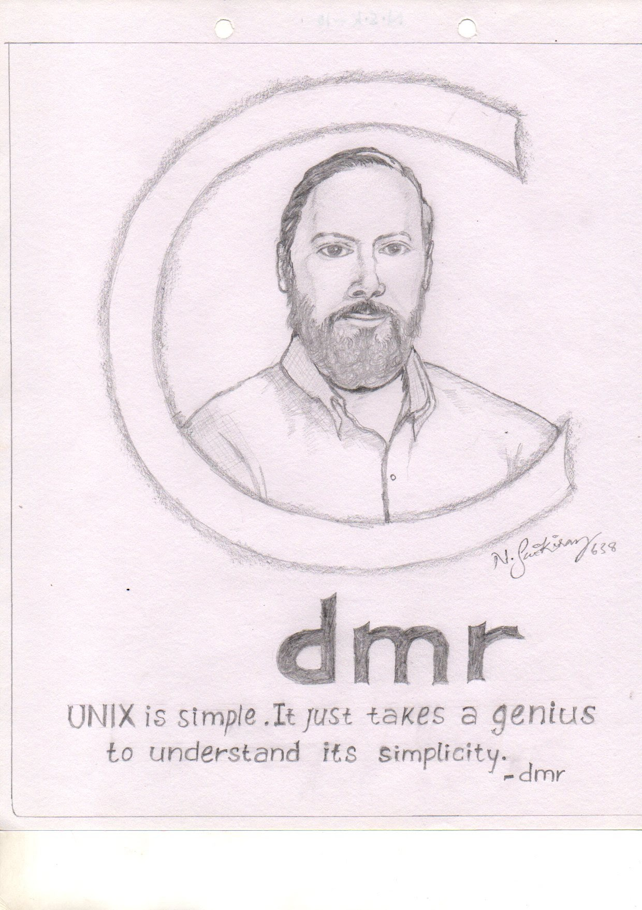

*[If I have seen further it is by standing on the shoulders of Giants](https://en.wikipedia.org/wiki/Standing_on_the_shoulders_of_giants)
should explain the title. Everyone I've learned from counts. I don't even know their names because there are so many of them.
But they shall be remembered.*

----

I should have wrote this a couple of years ago, during my undergraduate studies.
Because it was then I felt this.

There are times where you'll dream of writing those complex applications while
you are practicing programs -- for example a program to add to two integers.
But it will definitely take some time to realise that
it'll take good amount of knowledge of underlying systems to work on
complex applications.

I was first introduced to Python.
The feeling of [discomfort](2015-01-07-A-Difficult-thing-for-beginners.md)
during transition from Python to C helped visualizing the implementation of Python's constructs.

As I was exploring C, understood many concepts that make up software systems as we see them today.
[ The C Programming Language ](https://www.goodreads.com/book/show/515601.The_C_Programming_Language)
book by Dennis M. Ritchie and Brian Kernighan helped me soo much. It explains C language in conjunction with UNIX concepts.
That book is concise, precise and always top my favorite books list.
In fact every book by [Brian Kernighan ](https://www.cs.princeton.edu/~bwk/) is worth reading.

C language also played important role in development of UNIX operating system.
Developed by  Ken Thompson, Dennis Ritchie and others.
We all know that the [Unix philosophy](https://en.wikipedia.org/wiki/Unix_philosophy) will definitely guide us through better software development.

You *must* see these videos about UNIX:
- [UNIX: Making Computers Easier To Use -- AT&T Archives film from 1982, Bell Laboratories](https://www.youtube.com/watch?v=XvDZLjaCJuw)
- [AT&T Archives: The UNIX Operating System](https://www.youtube.com/watch?v=tc4ROCJYbm0)

[UNIX pipe](https://en.wikipedia.org/wiki/Pipeline_(Unix)) contributed by Douglas McIlroy is still favorite of many people out there.
- [Unix Pipeline (Brian Kernighan) - Computerphile](https://www.youtube.com/watch?v=bKzonnwoR2I)

Soon after I've learned the still living impact of C language and UNIX philosophy,
I had to do this drawing and stick in my class room.

#### About C language:
- ["C" Programming Language: Brian Kernighan - Computerphile](https://www.youtube.com/watch?v=de2Hsvxaf8M)
- [Why C is so Influential - Computerphile](https://www.youtube.com/watch?v=ci1PJexnfNE)
- [The Development of the C Language](https://www.bell-labs.com/usr/dmr/www/chist.html)

#### Unix Tutorials:
- [UNIX tutorials](http://www.ee.surrey.ac.uk/Teaching/Unix/unixintro.html)

#### Dennis M. Ritchie:
- [Dennis M. Ritchie](https://www.bell-labs.com/usr/dmr/www/)
- [Dennis Ritchie's video interview June 2011 by DennisRitchie.in](https://www.youtube.com/watch?v=umF6SNYaJNw)

#### About bell labs:
- [The Factory of Ideas: Working at Bell Labs - Computerphile](https://www.youtube.com/watch?v=QFK6RG47bww)

To be continued ...

-------------------

Generally I would give my first preference to a writing by the creator, if available.
For better understanding.

See, for everything to be understood there needs a tiny spark of thought
that convinces you. That spark is very important. If you managed to get that
it means you understood well.

When transiting from Python from C, felt like downgrading

[Japan Prize Ceremony for Ken Thompson](https://www.youtube.com/watch?v=p-kWw0UTD2A)

[CHRONOLOGICAL LISTING OF A.M. TURING AWARD WINNERS](https://amturing.acm.org/byyear.cfm)